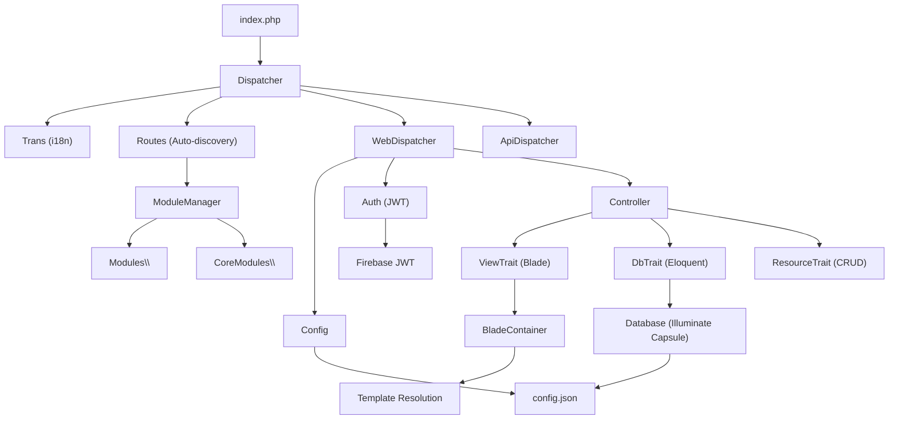

# Architecture & Directory Structure

Alxarafe follows a modular **MVC** pattern with **Convention over Configuration**: controllers, models, migrations, seeders, and templates are auto-discovered by scanning PSR-4 namespaces. No manual route files are required.

## PSR-4 Namespace Mapping

Defined in `composer.json`:

| Namespace | Path | Purpose |
|---|---|---|
| `Alxarafe\` | `src/Core/` | Framework kernel — controllers, models, services, tools |
| `Alxarafe\Scripts\` | `src/Scripts/` | Composer post-install scripts, asset publishing |
| `CoreModules\` | `src/Modules/` | Bundled core modules (Admin). Always active. |
| `Modules\` | `skeleton/Modules/` | Application-level modules. Activatable via settings. |
| `Tests\` | `Tests/`, `skeleton/Tests/` | PHPUnit test suites |

## Framework Directory Tree

```text
alxarafe/                         # Package root (ALX_PATH)
├── src/
│   ├── Core/                     # Framework kernel
│   │   ├── Attribute/            # PHP 8 Attributes (#[Menu], #[ApiRoute], etc.)
│   │   ├── Base/                 # Foundation classes
│   │   │   ├── Controller/       # Controller hierarchy
│   │   │   │   ├── Interface/    # ResourceInterface
│   │   │   │   └── Trait/        # DbTrait, ViewTrait, ResourceTrait
│   │   │   ├── Frontend/        # TemplateGenerator, ThemeManager
│   │   │   ├── Model/           # Base Model, DtoTrait, HasAuditLog
│   │   │   └── Testing/         # HttpResponseException
│   │   ├── Component/           # UI component system
│   │   │   ├── Container/       # Panel, Tab, TabGroup, Row, Separator, HtmlContent
│   │   │   ├── Enum/            # ActionPosition
│   │   │   ├── Fields/          # 15 field types (Boolean, Text, Select, etc.)
│   │   │   ├── Filter/          # 6 filter types (Text, Select, DateRange, etc.)
│   │   │   └── Workflow/        # StatusWorkflow, StatusTransition
│   │   ├── Lib/                 # Utility libraries
│   │   │   ├── Auth.php         # JWT authentication
│   │   │   ├── Functions.php    # HTTP helpers, URL, redirect
│   │   │   ├── Messages.php     # Flash message system
│   │   │   ├── Router.php       # Friendly URL matching/generation
│   │   │   ├── Routes.php       # Auto-discovery of controllers/models/migrations
│   │   │   └── Trans.php        # i18n (Symfony Translation + YAML)
│   │   ├── Service/             # Application services
│   │   │   ├── ApiDispatcher.php     # API request handler
│   │   │   ├── ApiRouter.php         # API route resolution
│   │   │   ├── EmailService.php      # SMTP email (Symfony Mailer)
│   │   │   ├── HookService.php       # Event/Hook system
│   │   │   ├── HookPoints.php        # Hook point definitions
│   │   │   ├── MarkdownService.php   # Markdown parsing (Parsedown)
│   │   │   ├── MarkdownSyncService.php # Doc synchronization
│   │   │   └── PdfService.php        # PDF generation (DOMPDF)
│   │   └── Tools/               # Infrastructure tools
│   │       ├── Debug.php             # DebugBar integration
│   │       ├── DependencyResolver.php # Module dependency DAG
│   │       ├── Dispatcher.php        # Main entry dispatcher
│   │       ├── Dispatcher/
│   │       │   ├── WebDispatcher.php  # HTML page dispatch
│   │       │   └── ApiDispatcher.php  # API JSON dispatch
│   │       └── ModuleManager.php     # Module scanning & menus
│   ├── Frontend/
│   │   └── ts/              # TypeScript source (compiled via Webpack)
│   ├── Lang/                # YAML translation files (18 languages)
│   ├── Modules/             # Core modules
│   │   └── Admin/           # Bundled Admin module
│   │       ├── Api/         # LoginController, UserApiController
│   │       ├── Controller/  # Auth, Config, Dictionary, Error, Home, ...
│   │       ├── Migrations/  # 8 migration files
│   │       ├── Model/       # User, Role, Permission, Setting, ...
│   │       ├── Seeders/     # UserSeeder
│   │       ├── Service/     # MenuManager, NotificationManager, ...
│   │       └── Templates/   # Blade views
│   ├── Scripts/             # Composer scripts & utilities
│   └── public/              # (empty, assets published at runtime)
├── skeleton/                # Skeleton application for development
│   ├── public/              # Entry point (index.php)
│   ├── Modules/             # Application modules
│   ├── config/              # config.json location
│   ├── templates/           # Application-level templates
│   └── themes/              # Theme directories
├── templates/               # Framework default Blade templates
├── assets/                  # Static assets (CSS, JS, images)
├── Tests/                   # PHPUnit tests
└── doc/                     # Documentation (en/, es/)
```

## Application Directory Tree

When Alxarafe is installed as a Composer dependency, the consuming application follows a parallel structure:

```text
my-application/              # Application root (APP_PATH)
├── config/
│   └── config.json          # Application configuration
├── public/                  # Document Root (BASE_PATH)
│   ├── index.php            # Entry point
│   ├── css/                 # Published CSS assets
│   ├── js/                  # Published JS assets
│   └── themes/              # Published theme assets
├── Modules/                 # Application-specific modules
│   └── Blog/
│       ├── Controller/
│       ├── Model/
│       ├── Api/
│       ├── Migrations/
│       └── Templates/
├── templates/               # Application-level template overrides
├── routes.php               # Optional custom route definitions
└── vendor/
    └── alxarafe/alxarafe/   # Framework package (ALX_PATH)
```

## Path Constants

The framework defines four critical constants during bootstrap:

| Constant | Description | Example |
|---|---|---|
| `ALX_PATH` | Root of the Alxarafe package | `/var/www/vendor/alxarafe/alxarafe` |
| `APP_PATH` | Root of the consuming application | `/var/www` |
| `BASE_PATH` | Public document root (`APP_PATH/public`) | `/var/www/public` |
| `BASE_URL` | Base URL of the application | `https://example.com` |

These are initialized in `Dispatcher::initializeConstants()` and are available globally throughout the framework.

## Dependency Graph



## Key Dependencies

| Package | Version | Use |
|---|---|---|
| `illuminate/database` | ^10.48 | Eloquent ORM, Query Builder, Schema Builder |
| `illuminate/view` | ^10.48 | Blade template compilation |
| `illuminate/events` | ^10.48 | Event dispatcher (required by Illuminate) |
| `jenssegers/blade` | ^2.0 | Standalone Blade container |
| `symfony/translation` | ^6.4 / ^7.0 | i18n translation layer |
| `symfony/yaml` | ^6.4 / ^7.0 | YAML language file parsing |
| `symfony/mailer` | ^7.2 | Email sending service |
| `firebase/php-jwt` | ^7.0 | JWT token creation and validation |
| `erusev/parsedown` | ^1.7 | Markdown to HTML conversion |
| `dompdf/dompdf` | ^3.1 | HTML to PDF generation |
| `symfony/var-dumper` | ^6.4 / ^7.0 | Enhanced debugging output |
