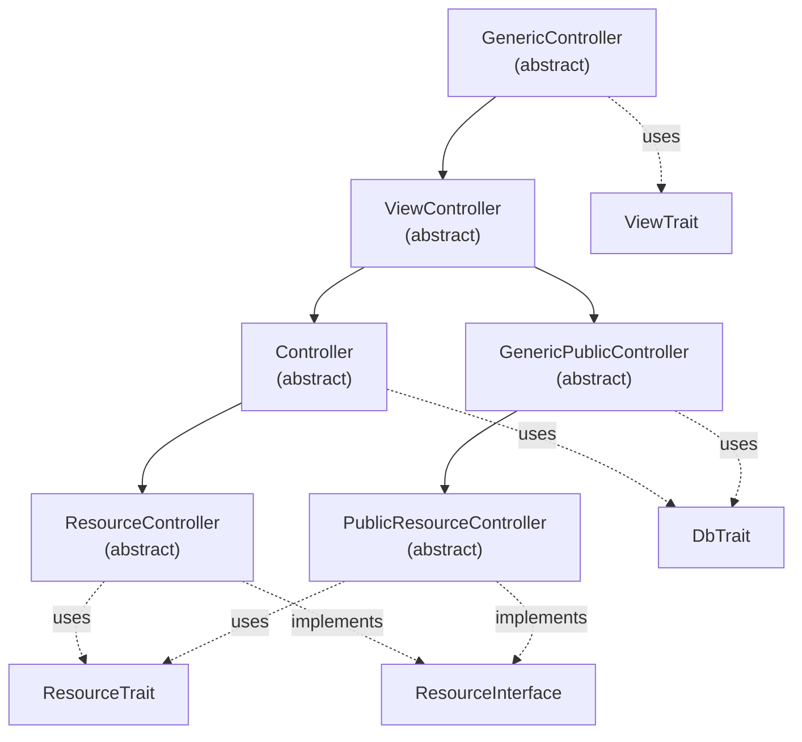

# Controllers – API Reference

`Namespace: Alxarafe\Base\Controller`

The controller hierarchy in Alxarafe follows a layered inheritance pattern where each level adds capabilities: menus, views, authentication, database, and CRUD operations.

## Inheritance Diagram



## When to Extend Each Controller

| Controller | Auth | DB | Views | CRUD | Use Case |
|---|---|---|---|---|---|
| `GenericController` | ✗ | ✗ | ✗ | ✗ | Minimal base, CLI scripts |
| `ViewController` | ✗ | ✗ | ✓ | ✗ | Static pages without auth/DB |
| `GenericPublicController` | ✗ | ✓ | ✓ | ✗ | Public pages with DB (login, registration) |
| `Controller` | ✓ | ✓ | ✓ | ✗ | Authenticated pages with custom logic |
| `ResourceController` | ✓ | ✓ | ✓ | ✓ | Standard CRUD for Eloquent models |
| `PublicResourceController` | ✗ | ✓ | ✓ | ✓ | Public CRUD (rare, e.g. public catalog) |

---

## `GenericController` (abstract)

**Namespace:** `Alxarafe\Base\Controller\GenericController`  
**Source:** [GenericController.php](file:///home/rsanjose/Desarrollo/Alxarafe/alxarafe/src/Core/Base/Controller/GenericController.php)

Base controller providing action dispatch, menu building, and trait auto-initialization. All controllers ultimately extend this class.

### Properties

| Property | Type | Description |
|---|---|---|
| `$action` | `string` | Current action name (from `$_GET['action']` or constructor) |
| `$topMenu` | `array` | Top navigation menu items |
| `$sidebar_menu` | `array` | Sidebar menu items (legacy Blade support) |
| `$backUrl` | `?string` | Auto-computed "back" URL |
| `$title` | `string` | Page title |
| `$data` | `mixed` | Arbitrary data passed to the controller |

### Key Methods

| Method | Signature | Description |
|---|---|---|
| `index()` | `public index(bool $executeActions = true): bool` | Default entry point. Calls `executeAction()`. |
| `executeAction()` | `protected executeAction(): bool` | Resolves `do{Action}()` method and runs `beforeAction()` → `doAction()` → `afterAction()` chain. |
| `beforeAction()` | `public beforeAction(): bool` | Hook: override for pre-processing. Returns `false` to abort. |
| `afterAction()` | `public afterAction(): bool` | Hook: override for post-processing. |
| `getModuleName()` | `public static getModuleName(): string` | Extracts module name from namespace (e.g. `CoreModules\Admin\...` → `'Admin'`). |
| `getControllerName()` | `public static getControllerName(): string` | Extracts controller name (strips `Controller` suffix). |
| `url()` | `public static url($action = 'index', $params = []): string` | Generates URL for this controller. Attempts friendly URL via `Router::generate()`. |
| `getMenu()` | `public static getMenu(): string\|array\|false` | Reads the `MENU` constant if defined. |
| `getSidebarMenu()` | `public static getSidebarMenu(): array\|false` | Reads `MENU` + `SIDEBAR_MENU` constants. |
| `getActions()` | `public static getActions(): array<string>` | Lists all `do*` methods (available actions). |
| `jsonResponse()` | `protected jsonResponse(array $data): void` | Outputs JSON and exits. |

### Example

```php
class MyController extends GenericController
{
    public function doProcess(): bool
    {
        // Business logic here
        $this->jsonResponse(['status' => 'ok']);
        return true;
    }
}
```

---

## `ViewController` (abstract)

**Namespace:** `Alxarafe\Base\Controller\ViewController`  
**Extends:** `GenericController`  
**Uses:** `ViewTrait`  
**Source:** [ViewController.php](file:///home/rsanjose/Desarrollo/Alxarafe/alxarafe/src/Core/Base/Controller/ViewController.php)

Adds Blade template support, configuration loading, and translation helpers.

### Additional Properties

| Property | Type | Description |
|---|---|---|
| `$config` | `?object` | Configuration from `config.json` |
| `$debug` | `bool` | Debug mode flag |
| `$alerts` | `array` | Messages/alerts to display in view |

### Key Methods

| Method | Signature | Description |
|---|---|---|
| `trans()` | `public trans(string $key, array $replace = [], ?string $domain = null): string` | Translation helper for templates (`$me->trans('key')`). |
| `_()` | `public static _(string $key, ...): string` | Static translation proxy. |
| `getRenderHeader()` | `public getRenderHeader(): string` | Returns DebugBar header HTML if debug enabled. |
| `getRenderFooter()` | `public getRenderFooter(): string` | Returns DebugBar footer HTML if debug enabled. |
| `afterAction()` | `public afterAction(): bool` | Loads messages and calls `$this->render()`. |

### ViewTrait Methods (mixed in)

| Method | Signature | Description |
|---|---|---|
| `setDefaultTemplate()` | `public setDefaultTemplate(?string $name = null): void` | Initializes or updates the template name. |
| `addVariable()` | `public addVariable(string $name, mixed $value): void` | Injects a variable into the Blade view. |
| `addVariables()` | `public addVariables(array $vars): void` | Bulk-injects variables. |
| `setTemplatesPath()` | `public setTemplatesPath(array $paths): void` | Sets template search paths. |
| `addTemplatesPath()` | `public addTemplatesPath(string $path): void` | Appends a template path. |
| `render()` | `public render(?string $viewPath = null): string` | Compiles and returns the Blade template output. |

---

## `Controller` (abstract)

**Namespace:** `Alxarafe\Base\Controller\Controller`  
**Extends:** `ViewController`  
**Uses:** `DbTrait`  
**Source:** [Controller.php](file:///home/rsanjose/Desarrollo/Alxarafe/alxarafe/src/Core/Base/Controller/Controller.php)

Adds authentication, authorization, module activation checks, and database connectivity.

### Additional Properties

| Property | Type | Description |
|---|---|---|
| `$username` | `?string` | Authenticated user's name |

### Constructor Behavior

1. Calls `ViewController::__construct()` (config, templates, menus)
2. **Authentication**: Checks `Auth::isLogged()`, redirects to login if not
3. **Module check**: Verifies module is enabled via `MenuManager::isModuleEnabled()`
4. **Authorization**: Calls `Auth::$user->can($action, $controller, $module)`

### Key Methods

| Method | Signature | Description |
|---|---|---|
| `shouldEnforceAuth()` | `protected shouldEnforceAuth(): bool` | Override to `return false` to skip auth (e.g., during installation). |

### DbTrait Methods (mixed in)

| Method | Signature | Description |
|---|---|---|
| `connectDb()` | `public static connectDb(?stdClass $dbConfig = null): bool` | Singleton database connection. Auto-called via `initDbTrait()`. |

---

## `GenericPublicController` (abstract)

**Namespace:** `Alxarafe\Base\Controller\GenericPublicController`  
**Extends:** `ViewController`  
**Uses:** `DbTrait`  
**Source:** [GenericPublicController.php](file:///home/rsanjose/Desarrollo/Alxarafe/alxarafe/src/Core/Base/Controller/GenericPublicController.php)

Provides view and database access **without authentication**. Used for login pages, public forms, and error pages.

---

## `ResourceController` (abstract)

**Namespace:** `Alxarafe\Base\Controller\ResourceController`  
**Extends:** `Controller`  
**Implements:** `ResourceInterface`  
**Uses:** `ResourceTrait`  
**Source:** [ResourceController.php](file:///home/rsanjose/Desarrollo/Alxarafe/alxarafe/src/Core/Base/Controller/ResourceController.php)

The primary controller for CRUD operations. Provides automatic list/edit mode detection, form generation from model metadata, and component-based UI assembly.

### ResourceTrait Key Methods

| Method | Signature | Description |
|---|---|---|
| `getModelClass()` | `abstract protected getModelClass(): string\|array` | Returns model FQCN or array of tab→model mappings. |
| `getListColumns()` | `protected getListColumns(): array` | Define columns for list view. Empty = auto-scaffold from model. |
| `getEditFields()` | `protected getEditFields(): array` | Define fields for edit form. Empty = auto-scaffold from model. |
| `getFilters()` | `protected getFilters(): array` | Define list view filters. |
| `getTabs()` | `protected getTabs(): array` | Generate Tab objects for tabbed forms. |
| `getTabVisibility()` | `protected getTabVisibility(): array<string, callable(): bool>` | Define conditional tab visibility. |
| `getTabBadges()` | `protected getTabBadges(): array<string, callable(): ?int>` | Define badge counts for tabs. |
| `doIndex()` | `public doIndex(): bool` | Default action: runs `privateCore()`. |
| `doSave()` | `public doSave(): bool` | Save action: runs `privateCore()`. |
| `doDelete()` | `public doDelete(): bool` | Delete action with hook support. |
| `doCreate()` | `public doCreate(): bool` | Creation entry point. |
| `beforeConfig()` | `protected beforeConfig(): void` | Hook: before configuration building. |
| `beforeList()` | `protected beforeList(): void` | Hook: before list mode processing. |
| `beforeEdit()` | `protected beforeEdit(): void` | Hook: before edit mode processing. |
| `afterSaveRecord()` | `protected afterSaveRecord(Model $model, array $data): void` | Hook: after saving a record. |
| `setup()` | `protected setup(): void` | Configure default buttons (New, Save, Back). |
| `insertTabAfter()` | `protected insertTabAfter(array $tabs, string $afterKey, Tab $newTab): array` | Helper to insert a tab after a specific key. |

### Example: Complete ResourceController

```php
namespace Modules\Blog\Controller;

use Alxarafe\Base\Controller\ResourceController;
use Alxarafe\Component\Fields\Text;
use Alxarafe\Component\Fields\Textarea;
use Alxarafe\Component\Fields\Select;
use Alxarafe\Component\Fields\DateTime;
use Modules\Blog\Model\Post;

class PostController extends ResourceController
{
    protected function getModelClass(): string
    {
        return Post::class;
    }

    protected function getListColumns(): array
    {
        return [
            new Text('title', 'Title'),
            new Select('status', 'Status', ['options' => ['draft', 'published']]),
            new DateTime('created_at', 'Created'),
        ];
    }

    protected function getEditFields(): array
    {
        return [
            'general' => [
                'label' => 'General',
                'fields' => [
                    new Text('title', 'Title', ['required' => true]),
                    new Textarea('body', 'Content', ['required' => true]),
                    new Select('status', 'Status', [
                        'options' => ['draft' => 'Draft', 'published' => 'Published']
                    ]),
                ],
            ],
            'metadata' => [
                'label' => 'Metadata',
                'fields' => [
                    new Text('slug', 'URL Slug'),
                    new Text('meta_description', 'Meta Description'),
                ],
            ],
        ];
    }
}
```

---

## `PublicResourceController` (abstract)

**Namespace:** `Alxarafe\Base\Controller\PublicResourceController`  
**Extends:** `GenericPublicController`  
**Implements:** `ResourceInterface`  
**Uses:** `ResourceTrait`  
**Source:** [PublicResourceController.php](file:///home/rsanjose/Desarrollo/Alxarafe/alxarafe/src/Core/Base/Controller/PublicResourceController.php)

Same as `ResourceController` but without authentication. Rarely used; suitable for public catalogs.

---

## `ApiController` (abstract)

**Namespace:** `Alxarafe\Base\Controller\ApiController`  
**Source:** [ApiController.php](file:///home/rsanjose/Desarrollo/Alxarafe/alxarafe/src/Core/Base/Controller/ApiController.php)

Base controller for REST API endpoints. Handles JWT authentication and JSON responses.

### Key Methods

| Method | Signature | Description |
|---|---|---|
| `jsonResponse()` | `protected jsonResponse(array $data): void` | Output JSON and exit |
| `badApiCall()` | `protected badApiCall(string $msg, int $code = 400): void` | Output error JSON and exit |

---

## `ResourceInterface`

**Namespace:** `Alxarafe\Base\Controller\Interface\ResourceInterface`  
**Source:** [ResourceInterface.php](file:///home/rsanjose/Desarrollo/Alxarafe/alxarafe/src/Core/Base/Controller/Interface/ResourceInterface.php)

Defines the mode constants and method contracts for CRUD controllers.

### Constants

| Constant | Value | Description |
|---|---|---|
| `MODE_LIST` | `'list'` | Listing mode |
| `MODE_EDIT` | `'edit'` | Edit/create mode |
