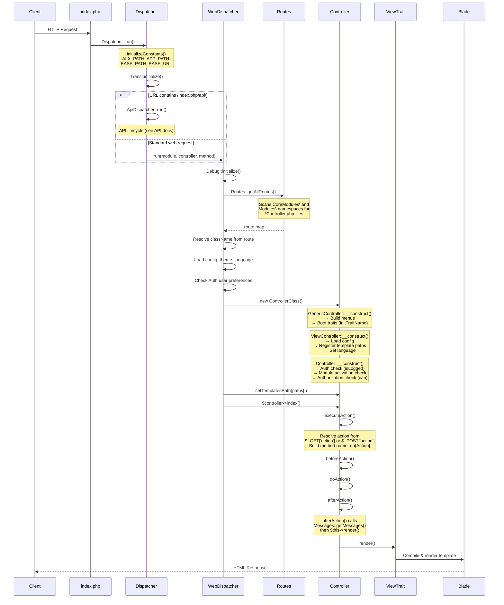

# Request Lifecycle

This document traces the complete lifecycle of an HTTP request handled by Alxarafe, from the entry point (`index.php`) to the rendered response.

## Sequence Diagram



## Phase 1: Bootstrap (`index.php`)

The web server directs all requests to `public/index.php`. A typical entry point:

```php
<?php
// public/index.php
require_once __DIR__ . '/../vendor/autoload.php';

define('BASE_PATH', __DIR__);

use Alxarafe\Tools\Dispatcher;

Dispatcher::run();
```

Alternatively, applications may use `WebDispatcher::dispatch()` directly for more control:

```php
<?php
require_once __DIR__ . '/../vendor/autoload.php';

define('BASE_PATH', __DIR__);

use Alxarafe\Tools\Dispatcher\WebDispatcher;

WebDispatcher::dispatch('MyModule', 'Home', 'index');
```

## Phase 2: Initialization (`Dispatcher::run()`)

`Dispatcher::run()` performs two initialization steps:

### 2a. Constant Definition

```php
// Dispatcher::initializeConstants()
ALX_PATH  = realpath(__DIR__ . '/../../..')     // Framework root
APP_PATH  = realpath(ALX_PATH . '/../../..')    // Application root
BASE_PATH = APP_PATH . '/public'               // Document root
BASE_URL  = Functions::getUrl()                 // Auto-detected URL
```

### 2b. Translation System

```php
Trans::initialize();  // Loads YAML language files from src/Lang/
```

### 2c. Routing Fork

The dispatcher inspects `$_SERVER['PHP_SELF']` for the pattern `/index.php/api/`:

- **API requests** → `ApiDispatcher::run($controllerPath)` → JSON response
- **Web requests** → `WebDispatcher::run($module, $controller, $method)` → HTML response

The module, controller and method are extracted from `$_GET` parameters:
- `module` defaults to `'Admin'`
- `controller` defaults to `'Info'`
- `method` defaults to `'index'`

## Phase 3: Route Resolution (`WebDispatcher::run()`)

### 3a. Debug Initialization

```php
Debug::initialize();  // Sets up DebugBar if in debug mode
```

### 3b. Route Discovery

```php
$routes = Routes::getAllRoutes();
$endpoint = $routes['Controller'][$module][$controller];
// e.g. "CoreModules\Admin\Controller\HomeController|/path/to/HomeController.php"
```

`Routes::getAllRoutes()` scans two namespace roots:

| Root | Namespace | Always Active |
|---|---|---|
| `src/Modules/` | `CoreModules\` | Yes |
| `APP_PATH/Modules/` | `Modules\` | Checked via `Setting` table |

For each module directory, it discovers:
- `Controller/*Controller.php` → Web controllers
- `Api/*Controller.php` → API controllers
- `Migrations/*.php` → Database migrations
- `Seeders/*.php` → Data seeders
- `Model/*.php` → Eloquent models

### 3c. Friendly URL Matching

Before falling back to `$_GET` parameters, `WebDispatcher::dispatch()` first attempts `Router::match()` against the request URI for friendly URLs.

### 3d. Theme & Language Resolution

The theme and language are resolved in priority order:

1. **Cookie** (`alx_theme`, `alx_lang`) — highest priority
2. **Authenticated user preferences** (`Auth::$user->getTheme()`, `Auth::$user->language`)
3. **Config file** (`config.json → main.theme`, `main.language`)
4. **Default** (`'default'` theme, `'en'` language)

## Phase 4: Controller Instantiation

The resolved class is instantiated. The constructor chain runs bottom-up through the inheritance hierarchy:

### 4a. `GenericController::__construct()`

1. **Action resolution**: `$action = $action ?? $_POST['action'] ?? $_GET['action'] ?? 'index'`
2. **Menu building**: `ModuleManager::getArrayMenu()` for top menu, `MenuManager::get('admin_sidebar')` for sidebar
3. **Back URL**: Auto-set if action ≠ `'index'`
4. **Trait boot**: For each trait, call `init{TraitName}()` if it exists

### 4b. `ViewController::__construct()`

5. **Config load**: `Config::getConfig()`
6. **Template path registration**: App templates → Theme templates → Framework templates
7. **Language init**: `Trans::setLang()`
8. **Variable injection**: `$me` = controller instance, `main_menu`, `user_menu`

### 4c. `Controller::__construct()`

9. **Authentication**: `Auth::isLogged()` — redirects to login if not
10. **Module activation**: `MenuManager::isModuleEnabled()` — blocks disabled modules
11. **Authorization**: `Auth::$user->can($action, $controller, $module)` — checks permissions
12. **Username**: Sets `$this->username` from authenticated user

### 4d. Template Path Setup

After instantiation, `WebDispatcher` sets the template search order:

```php
$templates_path = [
    APP_PATH . '/templates/themes/{theme}/',       // Theme override (App)
    ALX_PATH . '/templates/themes/{theme}/',       // Theme override (Package)
    APP_PATH . '/Modules/{Module}/templates/',     // Module templates (App)
    ALX_PATH . '/src/Modules/{Module}/Templates/', // Module templates (Package)
    APP_PATH . '/templates/',                       // App general templates
    ALX_PATH . '/templates/',                       // Framework default templates
];
```

## Phase 5: Action Execution

### 5a. Method Call

`WebDispatcher` calls `$controller->index()` (or the resolved method).

### 5b. `GenericController::index()` → `executeAction()`

1. **Permission re-check** for the specific action
2. **Method resolution**: `'do' . ucfirst(Str::camel($this->action))` — e.g., `action='create'` → `doCreate()`
3. **Hook chain**:
   - `beforeAction()` — override for pre-processing
   - `doAction()` — the actual business logic
   - `afterAction()` — post-processing and rendering

### 5c. Return Convention

Each method in the chain returns `bool`. If any returns `false`, the chain short-circuits:

```php
return $this->beforeAction()
    && $this->$actionMethod()
    && $this->afterAction();
```

## Phase 6: Rendering

### 6a. `ViewController::afterAction()`

```php
public function afterAction(): bool
{
    $this->alerts = Messages::getMessages();
    echo $this->render();
    return true;
}
```

### 6b. Template Resolution

`ViewTrait::render()` resolves the Blade template name from the controller:
- Convention: `page/{controller_name}` (lowercase, snake_case)
- Example: `HomeController` → `page/home`

### 6c. Blade Compilation

The `BladeContainer` compiles and renders the template with all injected variables (`$me`, `$main_menu`, `$user_menu`, `$alerts`, etc.).

## Phase 7: Error Handling

The entire dispatch is wrapped in a `try/catch`:

1. **First failure** → Redirect to `ErrorController::url()` with message and trace
2. **Second failure** (anti-loop guard) → Render raw HTML error page directly
3. **Emergency fallback** → `http_response_code(500)` with minimal styled error

## Summary Table

| Phase | Class | Key Method |
|---|---|---|
| Bootstrap | `index.php` | `Dispatcher::run()` |
| Init | `Dispatcher` | `initializeConstants()`, `Trans::initialize()` |
| Route | `WebDispatcher` | `run()`, `Routes::getAllRoutes()` |
| Instantiate | Controller hierarchy | `__construct()` chain |
| Execute | `GenericController` | `executeAction()` → `beforeAction()` → `doAction()` → `afterAction()` |
| Render | `ViewController` / `ViewTrait` | `afterAction()` → `render()` |
| Error | `WebDispatcher` | `dieWithMessage()` → `ErrorController` |
