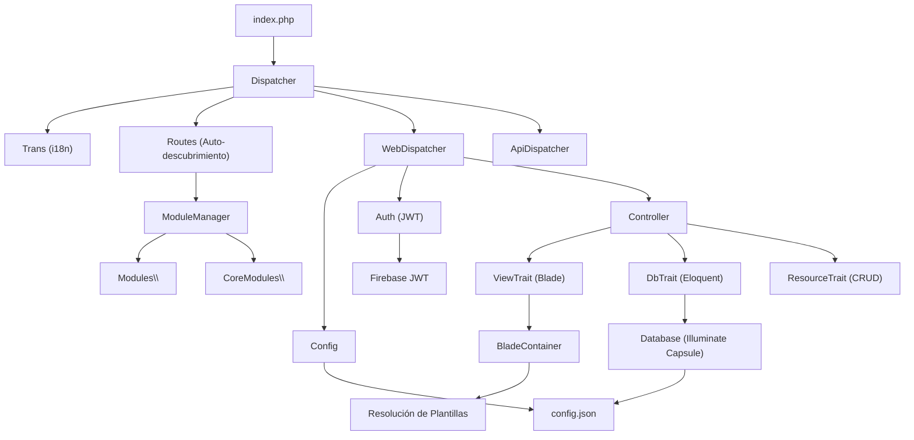

# Arquitectura y Estructura de Directorios

Alxarafe sigue un patrón **MVC** modular con **Convención sobre Configuración**: controladores, modelos, migraciones, seeders y plantillas se auto-descubren escaneando namespaces PSR-4. No se necesitan archivos de rutas manuales.

## Mapeo de Namespaces PSR-4

Definido en `composer.json`:

| Namespace | Ruta | Propósito |
|---|---|---|
| `Alxarafe\` | `src/Core/` | Kernel del framework — controladores, modelos, servicios, herramientas |
| `Alxarafe\Scripts\` | `src/Scripts/` | Scripts post-instalación de Composer, publicación de assets |
| `CoreModules\` | `src/Modules/` | Módulos core integrados (Admin). Siempre activos. |
| `Modules\` | `skeleton/Modules/` | Módulos de aplicación. Activables vía configuración. |
| `Tests\` | `Tests/`, `skeleton/Tests/` | Suites de test PHPUnit |

## Árbol de Directorios del Framework

```text
alxarafe/                         # Raíz del paquete (ALX_PATH)
├── src/
│   ├── Core/                     # Kernel del framework
│   │   ├── Attribute/            # Atributos PHP 8 (#[Menu], #[ApiRoute], etc.)
│   │   ├── Base/                 # Clases fundacionales
│   │   │   ├── Controller/       # Jerarquía de controladores
│   │   │   │   ├── Interface/    # ResourceInterface
│   │   │   │   └── Trait/        # DbTrait, ViewTrait, ResourceTrait
│   │   │   ├── Frontend/        # TemplateGenerator, ThemeManager
│   │   │   ├── Model/           # Model base, DtoTrait, HasAuditLog
│   │   │   └── Testing/         # HttpResponseException
│   │   ├── Component/           # Sistema de componentes UI
│   │   │   ├── Container/       # Panel, Tab, TabGroup, Row, Separator, HtmlContent
│   │   │   ├── Enum/            # ActionPosition
│   │   │   ├── Fields/          # 15 tipos de campo (Boolean, Text, Select, etc.)
│   │   │   ├── Filter/          # 6 tipos de filtro (Text, Select, DateRange, etc.)
│   │   │   └── Workflow/        # StatusWorkflow, StatusTransition
│   │   ├── Lib/                 # Bibliotecas utilitarias
│   │   │   ├── Auth.php         # Autenticación JWT
│   │   │   ├── Functions.php    # Helpers HTTP, URL, redirect
│   │   │   ├── Messages.php     # Sistema de mensajes flash
│   │   │   ├── Router.php       # Matching/generación de URLs amigables
│   │   │   ├── Routes.php       # Auto-descubrimiento de controladores/modelos/migraciones
│   │   │   └── Trans.php        # i18n (Symfony Translation + YAML)
│   │   ├── Service/             # Servicios de aplicación
│   │   │   ├── ApiDispatcher.php     # Manejador de peticiones API
│   │   │   ├── ApiRouter.php         # Resolución de rutas API
│   │   │   ├── EmailService.php      # Email SMTP (Symfony Mailer)
│   │   │   ├── HookService.php       # Sistema de eventos/hooks
│   │   │   ├── HookPoints.php        # Definiciones de puntos de hook
│   │   │   ├── MarkdownService.php   # Parsing Markdown (Parsedown)
│   │   │   ├── MarkdownSyncService.php # Sincronización de documentación
│   │   │   └── PdfService.php        # Generación PDF (DOMPDF)
│   │   └── Tools/               # Herramientas de infraestructura
│   │       ├── Debug.php             # Integración DebugBar
│   │       ├── DependencyResolver.php # DAG de dependencias de módulos
│   │       ├── Dispatcher.php        # Despachador principal
│   │       ├── Dispatcher/
│   │       │   ├── WebDispatcher.php  # Despacho de páginas HTML
│   │       │   └── ApiDispatcher.php  # Despacho de JSON API
│   │       └── ModuleManager.php     # Escaneo de módulos y menús
│   ├── Frontend/
│   │   └── ts/              # Código TypeScript (compilado vía Webpack)
│   ├── Lang/                # Archivos de traducción YAML (18 idiomas)
│   ├── Modules/             # Módulos core
│   │   └── Admin/           # Módulo Admin integrado
│   │       ├── Api/         # LoginController, UserApiController
│   │       ├── Controller/  # Auth, Config, Dictionary, Error, Home, ...
│   │       ├── Migrations/  # 8 archivos de migración
│   │       ├── Model/       # User, Role, Permission, Setting, ...
│   │       ├── Seeders/     # UserSeeder
│   │       ├── Service/     # MenuManager, NotificationManager, ...
│   │       └── Templates/   # Vistas Blade
│   ├── Scripts/             # Scripts de Composer y utilidades
│   └── public/              # (vacío, assets se publican en runtime)
├── skeleton/                # Aplicación esqueleto para desarrollo
│   ├── public/              # Punto de entrada (index.php)
│   ├── Modules/             # Módulos de aplicación
│   ├── config/              # Ubicación de config.json
│   ├── templates/           # Plantillas de aplicación
│   └── themes/              # Directorios de temas
├── templates/               # Plantillas Blade por defecto del framework
├── assets/                  # Assets estáticos (CSS, JS, imágenes)
├── Tests/                   # Tests PHPUnit
└── doc/                     # Documentación (en/, es/)
```

## Árbol de Directorios de una Aplicación

Cuando Alxarafe se instala como dependencia de Composer, la aplicación consumidora sigue una estructura paralela:

```text
mi-aplicacion/               # Raíz de la aplicación (APP_PATH)
├── config/
│   └── config.json          # Configuración de la aplicación
├── public/                  # Document Root (BASE_PATH)
│   ├── index.php            # Punto de entrada
│   ├── css/                 # Assets CSS publicados
│   ├── js/                  # Assets JS publicados
│   └── themes/              # Assets de temas publicados
├── Modules/                 # Módulos específicos de la aplicación
│   └── Blog/
│       ├── Controller/
│       ├── Model/
│       ├── Api/
│       ├── Migrations/
│       └── Templates/
├── templates/               # Sobrescrituras de plantillas a nivel de aplicación
├── routes.php               # Definiciones de rutas personalizadas (opcional)
└── vendor/
    └── alxarafe/alxarafe/   # Paquete del framework (ALX_PATH)
```

## Constantes de Ruta

El framework define cuatro constantes críticas durante el arranque:

| Constante | Descripción | Ejemplo |
|---|---|---|
| `ALX_PATH` | Raíz del paquete Alxarafe | `/var/www/vendor/alxarafe/alxarafe` |
| `APP_PATH` | Raíz de la aplicación consumidora | `/var/www` |
| `BASE_PATH` | Document root público (`APP_PATH/public`) | `/var/www/public` |
| `BASE_URL` | URL base de la aplicación | `https://example.com` |

Se inicializan en `Dispatcher::initializeConstants()` y están disponibles globalmente en todo el framework.

## Grafo de Dependencias



## Dependencias Principales

| Paquete | Versión | Uso |
|---|---|---|
| `illuminate/database` | ^10.48 | ORM Eloquent, Query Builder, Schema Builder |
| `illuminate/view` | ^10.48 | Compilación de plantillas Blade |
| `illuminate/events` | ^10.48 | Despachador de eventos (requerido por Illuminate) |
| `jenssegers/blade` | ^2.0 | Contenedor Blade independiente |
| `symfony/translation` | ^6.4 / ^7.0 | Capa de traducción i18n |
| `symfony/yaml` | ^6.4 / ^7.0 | Parsing de archivos de idioma YAML |
| `symfony/mailer` | ^7.2 | Servicio de envío de email |
| `firebase/php-jwt` | ^7.0 | Creación y validación de tokens JWT |
| `erusev/parsedown` | ^1.7 | Conversión de Markdown a HTML |
| `dompdf/dompdf` | ^3.1 | Generación de HTML a PDF |
| `symfony/var-dumper` | ^6.4 / ^7.0 | Salida de depuración mejorada |
