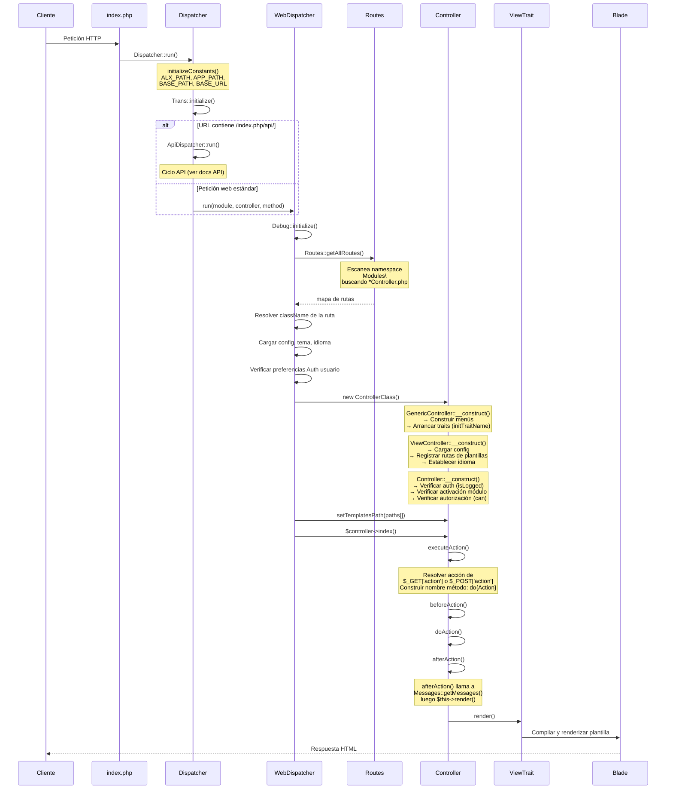

# Ciclo de Vida de una Petición

Este documento traza el ciclo de vida completo de una petición HTTP gestionada por Alxarafe, desde el punto de entrada (`index.php`) hasta la respuesta renderizada.

## Diagrama de Secuencia



## Fase 1: Arranque (`index.php`)

El servidor web dirige todas las peticiones a `public/index.php`. Un punto de entrada típico:

```php
<?php
// public/index.php
require_once __DIR__ . '/../vendor/autoload.php';

define('BASE_PATH', __DIR__);

use Alxarafe\Tools\Dispatcher;

Dispatcher::run();
```

Alternativamente, las aplicaciones pueden usar `WebDispatcher::dispatch()` directamente para mayor control:

```php
<?php
require_once __DIR__ . '/../vendor/autoload.php';

define('BASE_PATH', __DIR__);

use Alxarafe\Tools\Dispatcher\WebDispatcher;

WebDispatcher::dispatch('MiModulo', 'Home', 'index');
```

## Fase 2: Inicialización (`Dispatcher::run()`)

`Dispatcher::run()` realiza dos pasos de inicialización:

### 2a. Definición de Constantes

```php
// Dispatcher::initializeConstants()
ALX_PATH  = realpath(__DIR__ . '/../../..')     // Raíz del framework
APP_PATH  = realpath(ALX_PATH . '/../../..')    // Raíz de la aplicación
BASE_PATH = APP_PATH . '/public'               // Document root
BASE_URL  = Functions::getUrl()                 // URL auto-detectada
```

### 2b. Sistema de Traducciones

```php
Trans::initialize();  // Carga archivos YAML de idioma desde src/Lang/
```

### 2c. Bifurcación de Rutas

El dispatcher inspecciona `$_SERVER['PHP_SELF']` buscando el patrón `/index.php/api/`:

- **Peticiones API** → `ApiDispatcher::run($controllerPath)` → respuesta JSON
- **Peticiones Web** → `WebDispatcher::run($module, $controller, $method)` → respuesta HTML

El módulo, controlador y método se extraen de los parámetros `$_GET`:
- `module` por defecto `'Admin'`
- `controller` por defecto `'Info'`
- `method` por defecto `'index'`

## Fase 3: Resolución de Rutas (`WebDispatcher::run()`)

### 3a. Inicialización de Debug

```php
Debug::initialize();  // Configura DebugBar si está en modo debug
```

### 3b. Descubrimiento de Rutas

```php
$routes = Routes::getAllRoutes();
$endpoint = $routes['Controller'][$module][$controller];
// ej. "Modules\Admin\Controller\HomeController|/ruta/a/HomeController.php"
```

`Routes::getAllRoutes()` escanea dos raíces de namespace:

| Raíz | Namespace | Siempre Activo |
|---|---|---|
| `src/Modules/` | `Modules\` | Sí |
| `APP_PATH/Modules/` | `Modules\` | Verificado vía tabla `Setting` |

Para cada directorio de módulo, descubre:
- `Controller/*Controller.php` → Controladores web
- `Api/*Controller.php` → Controladores API
- `Migrations/*.php` → Migraciones de BD
- `Seeders/*.php` → Seeders de datos
- `Model/*.php` → Modelos Eloquent

### 3c. Matching de URLs Amigables

Antes de recurrir a los parámetros `$_GET`, `WebDispatcher::dispatch()` intenta primero `Router::match()` contra la URI de la petición para URLs amigables.

### 3d. Resolución de Tema e Idioma

El tema y el idioma se resuelven en orden de prioridad:

1. **Cookie** (`alx_theme`, `alx_lang`) — prioridad más alta
2. **Preferencias del usuario autenticado** (`Auth::$user->getTheme()`, `Auth::$user->language`)
3. **Archivo de configuración** (`config.json → main.theme`, `main.language`)
4. **Por defecto** (tema `'default'`, idioma `'en'`)

## Fase 4: Instanciación del Controlador

La clase resuelta se instancia. La cadena de constructores se ejecuta de abajo a arriba a través de la jerarquía de herencia:

### 4a. `GenericController::__construct()`

1. **Resolución de acción**: `$action = $action ?? $_POST['action'] ?? $_GET['action'] ?? 'index'`
2. **Construcción de menús**: `ModuleManager::getArrayMenu()` para menú superior, `MenuManager::get('admin_sidebar')` para barra lateral
3. **URL de retorno**: Auto-establecida si acción ≠ `'index'`
4. **Arranque de traits**: Para cada trait, llama a `init{TraitName}()` si existe

### 4b. `ViewController::__construct()`

5. **Carga de config**: `Config::getConfig()`
6. **Registro de rutas de plantillas**: Plantillas App → Plantillas Tema → Plantillas Framework
7. **Inicio de idioma**: `Trans::setLang()`
8. **Inyección de variables**: `$me` = instancia del controlador, `main_menu`, `user_menu`

### 4c. `Controller::__construct()`

9. **Autenticación**: `Auth::isLogged()` — redirige a login si no está logueado
10. **Activación de módulo**: `MenuManager::isModuleEnabled()` — bloquea módulos desactivados
11. **Autorización**: `Auth::$user->can($action, $controller, $module)` — verifica permisos
12. **Nombre de usuario**: Establece `$this->username` del usuario autenticado

### 4d. Configuración de Rutas de Plantillas

Tras la instanciación, `WebDispatcher` establece el orden de búsqueda de plantillas:

```php
$templates_path = [
    APP_PATH . '/templates/themes/{tema}/',        // Override de tema (App)
    ALX_PATH . '/templates/themes/{tema}/',        // Override de tema (Paquete)
    APP_PATH . '/Modules/{Modulo}/templates/',     // Plantillas de módulo (App)
    ALX_PATH . '/src/Modules/{Modulo}/Templates/', // Plantillas de módulo (Paquete)
    APP_PATH . '/templates/',                       // Plantillas generales de App
    ALX_PATH . '/templates/',                       // Plantillas por defecto del framework
];
```

## Fase 5: Ejecución de la Acción

### 5a. Llamada al Método

`WebDispatcher` llama a `$controller->index()` (o el método resuelto).

### 5b. `GenericController::index()` → `executeAction()`

1. **Re-verificación de permisos** para la acción específica
2. **Resolución del método**: `'do' . ucfirst(Str::camel($this->action))` — ej., `action='create'` → `doCreate()`
3. **Cadena de hooks**:
   - `beforeAction()` — sobrescribir para pre-procesamiento
   - `doAction()` — la lógica de negocio real
   - `afterAction()` — post-procesamiento y renderizado

### 5c. Convención de Retorno

Cada método en la cadena devuelve `bool`. Si alguno devuelve `false`, la cadena se cortocircuita:

```php
return $this->beforeAction()
    && $this->$actionMethod()
    && $this->afterAction();
```

## Fase 6: Renderizado

### 6a. `ViewController::afterAction()`

```php
public function afterAction(): bool
{
    $this->alerts = Messages::getMessages();
    echo $this->render();
    return true;
}
```

### 6b. Resolución de Plantilla

`ViewTrait::render()` resuelve el nombre de la plantilla Blade desde el controlador:
- Convención: `page/{nombre_controlador}` (minúsculas, snake_case)
- Ejemplo: `HomeController` → `page/home`

### 6c. Compilación Blade

El `BladeContainer` compila y renderiza la plantilla con todas las variables inyectadas (`$me`, `$main_menu`, `$user_menu`, `$alerts`, etc.).

## Fase 7: Manejo de Errores

Todo el despacho está envuelto en un `try/catch`:

1. **Primer fallo** → Redirige a `ErrorController::url()` con mensaje y traza
2. **Segundo fallo** (guardia anti-bucle) → Renderiza página HTML de error directamente
3. **Fallback de emergencia** → `http_response_code(500)` con error HTML mínimo estilizado

## Tabla Resumen

| Fase | Clase | Método Clave |
|---|---|---|
| Arranque | `index.php` | `Dispatcher::run()` |
| Inicialización | `Dispatcher` | `initializeConstants()`, `Trans::initialize()` |
| Rutas | `WebDispatcher` | `run()`, `Routes::getAllRoutes()` |
| Instanciación | Jerarquía de controladores | Cadena `__construct()` |
| Ejecución | `GenericController` | `executeAction()` → `beforeAction()` → `doAction()` → `afterAction()` |
| Renderizado | `ViewController` / `ViewTrait` | `afterAction()` → `render()` |
| Errores | `WebDispatcher` | `dieWithMessage()` → `ErrorController` |
