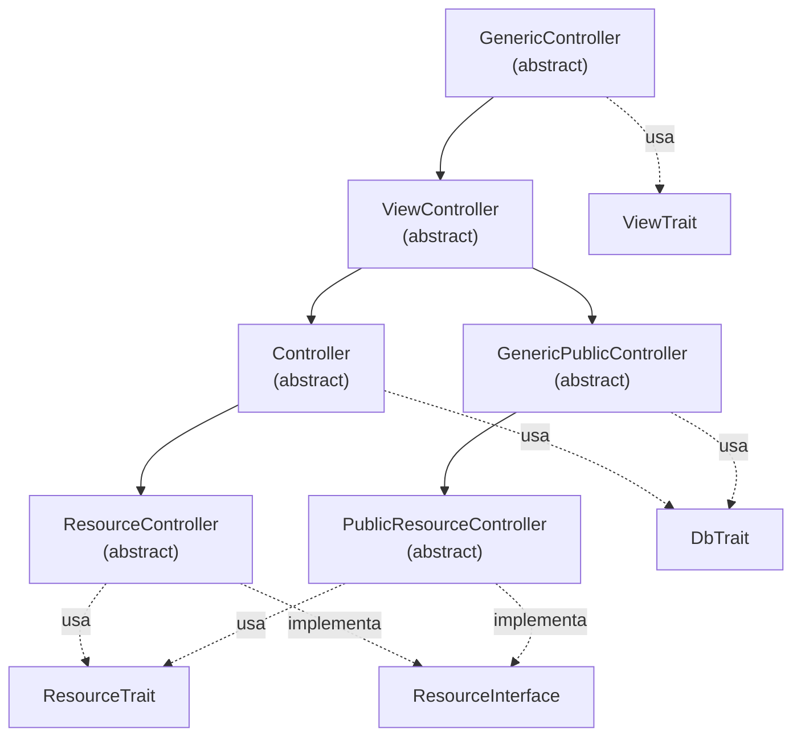

# Controladores – Referencia de API

`Namespace: Alxarafe\Base\Controller`

La jerarquía de controladores en Alxarafe sigue un patrón de herencia por capas donde cada nivel añade capacidades: menús, vistas, autenticación, base de datos y operaciones CRUD.

## Diagrama de Herencia



## Cuándo Extender Cada Controlador

| Controlador | Auth | BD | Vistas | CRUD | Caso de Uso |
|---|---|---|---|---|---|
| `GenericController` | ✗ | ✗ | ✗ | ✗ | Base mínima, scripts CLI |
| `ViewController` | ✗ | ✗ | ✓ | ✗ | Páginas estáticas sin auth/BD |
| `GenericPublicController` | ✗ | ✓ | ✓ | ✗ | Páginas públicas con BD (login, registro) |
| `Controller` | ✓ | ✓ | ✓ | ✗ | Páginas autenticadas con lógica personalizada |
| `ResourceController` | ✓ | ✓ | ✓ | ✓ | CRUD estándar para modelos Eloquent |
| `PublicResourceController` | ✗ | ✓ | ✓ | ✓ | CRUD público (raro, ej. catálogo público) |

---

## `GenericController` (abstract)

**Namespace:** `Alxarafe\Base\Controller\GenericController`

Controlador base que proporciona despacho de acciones, construcción de menús e inicio automático de traits.

### Propiedades

| Propiedad | Tipo | Descripción |
|---|---|---|
| `$action` | `string` | Nombre de la acción actual |
| `$topMenu` | `array` | Elementos del menú superior |
| `$sidebar_menu` | `array` | Elementos del menú lateral |
| `$backUrl` | `?string` | URL de "volver" auto-calculada |
| `$title` | `string` | Título de la página |

### Métodos Clave

| Método | Firma | Descripción |
|---|---|---|
| `index()` | `public index(bool $executeActions = true): bool` | Punto de entrada por defecto. |
| `executeAction()` | `protected executeAction(): bool` | Resuelve `do{Action}()` y ejecuta cadena `beforeAction()` → `doAction()` → `afterAction()`. |
| `beforeAction()` | `public beforeAction(): bool` | Hook: pre-procesamiento. Devuelve `false` para abortar. |
| `afterAction()` | `public afterAction(): bool` | Hook: post-procesamiento. |
| `getModuleName()` | `public static getModuleName(): string` | Extrae nombre del módulo del namespace. |
| `getControllerName()` | `public static getControllerName(): string` | Extrae nombre del controlador. |
| `url()` | `public static url($action, $params): string` | Genera URL para este controlador. |

---

## `ViewController` (abstract)

**Extiende:** `GenericController`  
**Usa:** `ViewTrait`

Añade soporte de plantillas Blade, carga de configuración y helpers de traducción.

### Métodos ViewTrait

| Método | Firma | Descripción |
|---|---|---|
| `setDefaultTemplate()` | `public setDefaultTemplate(?string $name): void` | Inicializa la plantilla. |
| `addVariable()` | `public addVariable(string $name, mixed $value): void` | Inyecta variable en la vista Blade. |
| `render()` | `public render(?string $viewPath): string` | Compila y devuelve el HTML de la plantilla. |

---

## `Controller` (abstract)

**Extiende:** `ViewController`  
**Usa:** `DbTrait`

Añade autenticación, autorización, verificación de activación de módulos y conectividad de BD.

### Comportamiento del Constructor

1. Llama a `ViewController::__construct()`
2. **Autenticación**: `Auth::isLogged()` — redirige a login si no
3. **Módulo**: `MenuManager::isModuleEnabled()` — bloquea módulos desactivados
4. **Autorización**: `Auth::$user->can()` — verifica permisos

---

## `ResourceController` (abstract)

**Extiende:** `Controller`  
**Implementa:** `ResourceInterface`  
**Usa:** `ResourceTrait`

Controlador principal para operaciones CRUD. Detecta automáticamente modo lista/edición, genera formularios desde metadatos del modelo.

### Métodos ResourceTrait Clave

| Método | Firma | Descripción |
|---|---|---|
| `getModelClass()` | `abstract protected getModelClass(): string\|array` | Devuelve FQCN del modelo. |
| `getListColumns()` | `protected getListColumns(): array` | Columnas del listado. |
| `getEditFields()` | `protected getEditFields(): array` | Campos del formulario de edición. |
| `getFilters()` | `protected getFilters(): array` | Filtros del listado. |
| `getTabs()` | `protected getTabs(): array` | Pestañas para formularios con tabs. |
| `getTabVisibility()` | `protected getTabVisibility(): array` | Visibilidad condicional de pestañas. |
| `getTabBadges()` | `protected getTabBadges(): array` | Contadores badge en pestañas. |
| `doIndex()` | `public doIndex(): bool` | Acción por defecto. |
| `doSave()` | `public doSave(): bool` | Acción guardar. |
| `doDelete()` | `public doDelete(): bool` | Acción eliminar con hooks. |
| `beforeConfig()` | `protected beforeConfig(): void` | Hook: antes de construir configuración. |
| `beforeList()` | `protected beforeList(): void` | Hook: antes del listado. |
| `beforeEdit()` | `protected beforeEdit(): void` | Hook: antes de edición. |
| `afterSaveRecord()` | `protected afterSaveRecord(Model, array): void` | Hook: después de guardar registro. |

### Ejemplo

```php
namespace Modules\Blog\Controller;

use Alxarafe\Base\Controller\ResourceController;
use Alxarafe\Component\Fields\Text;
use Alxarafe\Component\Fields\Textarea;

class PostController extends ResourceController
{
    protected function getModelClass(): string
    {
        return \Modules\Blog\Model\Post::class;
    }

    protected function getEditFields(): array
    {
        return [
            'general' => [
                'label' => 'General',
                'fields' => [
                    new Text('title', 'Título', ['required' => true]),
                    new Textarea('body', 'Contenido'),
                ],
            ],
        ];
    }
}
```
