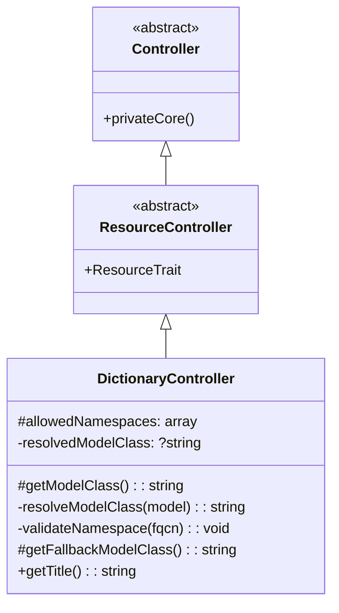
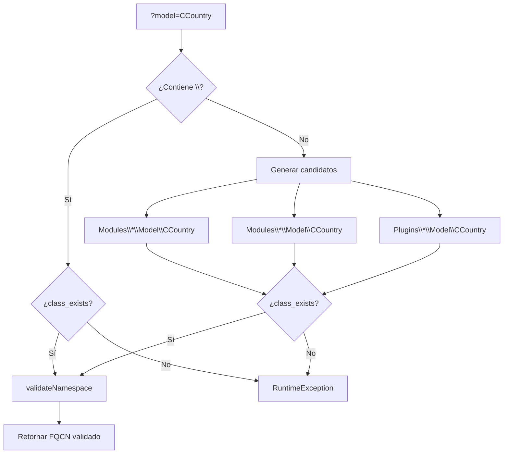

# DictionaryController — Controlador Genérico para Tablas de Referencia

## Resumen

`DictionaryController` es un controlador CRUD genérico que elimina la necesidad de escribir controladores individuales para las docenas de **tablas de referencia** (lookup/dictionary) que toda aplicación acumula: países, divisas, tipos de pago, idiomas, etc.

En lugar de crear un controlador por cada tabla, se invoca `DictionaryController` pasando el nombre del modelo como parámetro:

```
index.php?module=Admin&controller=Dictionary&model=CCountry
```

Las columnas del listado y los campos del formulario se **auto-generan** a partir del esquema del modelo (`Model::getFields()`), por lo que no se requiere configuración manual alguna.

---

## Ubicación

| Elemento | Ruta |
|---|---|
| **Clase** | `src/Modules/Admin/Controller/DictionaryController.php` |
| **Namespace** | `Modules\Admin\Controller` |
| **Herencia** | `DictionaryController → ResourceController → Controller` |
| **Trait aplicados** | `ResourceTrait` (1 762 líneas de lógica CRUD automática) |

---

## Arquitectura



### Flujo de resolución del modelo

Cuando se recibe `?model=CCountry`, el controlador sigue esta cadena:

1. **FQCN directo** — Si el parámetro ya contiene `\` y la clase existe, se usa directamente.
2. **Escaneo de módulos core** — Busca en `Modules\{Módulo}\Model\{Modelo}`.
3. **Escaneo de módulos skeleton** — Busca en `Modules\{Módulo}\Model\{Modelo}`.
4. **Escaneo de plugins** — Busca en `Plugins\{Plugin}\Model\{Modelo}`.

Si ninguna estrategia encuentra la clase, se lanza `RuntimeException`.



---

## Seguridad

### Validación de namespace

Solo se permite acceder a modelos cuyo FQCN comience por uno de los prefijos autorizados:

```php
protected array $allowedNamespaces = [
    'Modules\\',
    'Modules\\',
    'Plugins\\',
];
```

Esto impide que un usuario malintencionado apunte a clases arbitrarias del sistema (por ejemplo, clases de Illuminate o del propio PHP) a través del parámetro `?model=`.

### Sanitización de entrada

Antes de intentar resolver el nombre, se eliminan secuencias peligrosas:

```php
$model = str_replace(['/', '..', "\0"], '', $model);
```

### Extensibilidad segura

Las aplicaciones hijas pueden ampliar `$allowedNamespaces` sobreescribiendo `beforeConfig()`:

```php
protected function beforeConfig()
{
    $this->allowedNamespaces[] = 'MyApp\\';
}
```

---

## Integración en el Framework

### Menú

El controlador se registra automáticamente en el menú mediante el atributo PHP 8:

```php
#[Menu(menu: 'main_menu', label: 'Dictionaries', icon: 'fas fa-book', order: 20, parent: 'Configuration')]
```

Aparece como entrada hija de **Configuración** en el menú principal.

### Dashboard de Administración

En `templates/page/admin_home.blade.php` hay un acceso directo visual (tarjeta con icono `fa-book`) que enlaza a:

```
index.php?module=Admin&controller=Dictionary
```

### Auto-scaffolding

Cuando no se especifica `?model=`, el controlador usa el modelo `Setting` como fallback seguro (método `getFallbackModelClass()`). Esto garantiza que la página siempre renderice un listado válido.

El `ResourceTrait` se encarga de:

| Función | Descripción |
|---|---|
| `buildConfiguration()` | Detecta columnas y campos desde `Model::getFields()` |
| `convertModelFieldsToComponents()` | Convierte metadatos del esquema en componentes UI (Text, Boolean, Date, Integer, Decimal, Textarea…) |
| `detectMode()` | Lista si no hay `?id=`, Edición si lo hay |
| `setup()` | Genera automáticamente los botones **Nuevo**, **Guardar**, **Volver** |
| `handleRequest()` | Procesa AJAX `get_data`, `get_record`, `save_record` y botones personalizados |
| `fetchListData()` | Genera la query con filtros, paginación y ordenación |

### Título dinámico

El título de la página refleja el modelo activo:

```php
public function getTitle(): string
{
    $model = $_GET['model'] ?? 'Dictionary';
    return Trans::_('dictionary') . ': ' . $model;
}
```

---

## Uso Práctico

### Caso 1: Gestionar una tabla de diccionario existente

```
index.php?module=Admin&controller=Dictionary&model=Language
```

Esto genera un CRUD completo para el modelo `Language` sin escribir una sola línea de código adicional.

### Caso 2: Editar un registro concreto

```
index.php?module=Admin&controller=Dictionary&model=Language&id=3
```

El `ResourceTrait` detecta `?id=3` y entra en modo edición con formulario auto-generado.

### Caso 3: Crear un nuevo registro

```
index.php?module=Admin&controller=Dictionary&model=Language&id=new
```

### Caso 4: Controlador especializado que hereda de DictionaryController

Si una tabla de diccionario necesita lógica adicional (validaciones, campos calculados, relaciones), se puede crear un controlador hijo:

```php
class CurrencyController extends DictionaryController
{
    protected function getModelClass()
    {
        return Currency::class;
    }

    protected function getEditFields(): array
    {
        return [
            new Fields\Text('code', 'Código ISO', ['maxlength' => 3, 'required' => true]),
            new Fields\Text('name', 'Nombre'),
            new Fields\Decimal('exchange_rate', 'Tasa de cambio', ['min' => 0]),
        ];
    }
}
```

---

## Modelo Fallback

Cuando se accede a `?module=Admin&controller=Dictionary` **sin** parámetro `&model=`, se muestra el listado del modelo `Setting` (tabla `settings`, clave-valor). Este comportamiento se puede personalizar sobreescribiendo `getFallbackModelClass()`.

---

## Resumen técnico

| Concepto | Valor |
|---|---|
| **Patrón de diseño** | Controlador genérico parametrizado + Auto-scaffolding |
| **Clase padre** | `ResourceController` (→ `ResourceTrait`) |
| **Parámetro clave** | `?model=NombreModelo` |
| **Seguridad** | Whitelist de namespaces + sanitización de entrada |
| **Fallback** | `Setting::class` |
| **Menú** | `main_menu > Configuration > Dictionaries` |
| **Template** | `list.blade.php` del cache de recursos (`skeleton/var/cache/resources/Admin/Dictionary/`) |
| **Campos** | Auto-generados desde `Model::getFields()` |
| **Modos** | List (sin `?id=`) / Edit (con `?id=`) |
